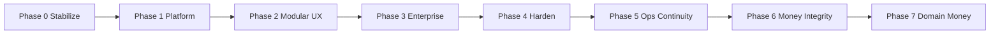

# PAMS Enterprise Transformation — Implementation Process

**System:** Permit Assessment & Management System (PAMS)  
**Document type:** Phased implementation roadmap  
**Based on:** Full-system architecture assessment  
**Last updated:** 2026-07-16

---

## 1. Purpose

This document defines how PAMS will be transformed from a feature-rich municipal modular monolith into a scalable, maintainable, enterprise-grade platform—without disrupting day-to-day operations.

It covers:

- Implementation principles
- Phase goals, scope, deliverables, and exit criteria
- Priority order and dependencies
- Roles, review, and release process
- Success metrics

---

## 2. Current State (Summary)

PAMS today includes:

| Domain | Status |
|--------|--------|
| Permits / Applications | Core workflow (assess → approve → pay → issue → release) |
| Citations & Enforcers | Operational + ETRACS |
| Rights & Rentals | Lessees, properties, leases, payments |
| Waterworks | Accounts, readings, billing, rates + mobile meter reader |
| Price Monitoring | Commodities, markets, alerts, analysis |
| Platform | Users, roles, settings, chat, notifications, reports |

**Primary constraints to address:**

- Fat route/page modules (2k+ LOC files)
- Permissions UI not enforced end-to-end
- Security gaps (Socket JWT, secrets, over-broad authorize)
- Unpaginated heavy lists (especially applications)
- Near-zero automated tests
- Schema/docs drift vs live migrations

---

## 3. Guiding Principles

1. **Stabilize before redesign** — fix security and performance first.
2. **Modular monolith first** — extract microservices only when justified.
3. **API-first** — contracts before UI rewrites.
4. **Permission-driven access** — role checkboxes must match runtime behavior.
5. **Small, reviewable PRs** — prefer incremental merges over big-bang rewrites.
6. **No downtime for core ops** — feature flags / backward-compatible APIs where possible.
7. **Test what money touches** — billing, assessments, payments, lease balances.

---

## 4. Target Architecture

### 4.1 Feature modules

```
platform/        auth, users, roles, settings, audit, notifications, chat, entities
permits/         applications, fees, rules, templates, permit reports
citations/       citations, enforcers, citation payments
rentals/         lessees, properties, leases, rental payments/reports
waterworks/      supplies, accounts, readings, billing, rates (+ mobile API)
markets/         price monitoring
integrations/    ETRACS, future GIS/ERP/treasury
```

### 4.2 Backend layering (per module)

```
routes/controllers  →  services (domain rules)  →  repositories (SQL)
```

### 4.3 Shared platform services

- Authentication & authorization
- Audit logging
- Notifications / task inbox
- Document generation (async jobs)
- Entity master data
- Unified payment ledger (Phase 2+)

---

## 5. Phased Implementation

### Phase 0 — Stabilize (1–2 weeks calendar)

**Goal:** Reduce production risk with minimal UX change.  
**Status:** Implemented 2026-07-16

| ID | Work item | Priority | Status |
|----|-----------|----------|--------|
| P0-1 | Verify JWT on Socket.IO; never trust client `userId` | Critical | Done |
| P0-2 | Remove hardcoded ETRACS API key/URL; rotate secrets; fix compose defaults | Critical | Done |
| P0-3 | Fix authorize gaps (citations writes, price records, reportTemplates/templates bugs) | Critical | Done |
| P0-4 | Paginate applications list; replace correlated subqueries with JOINs; add indexes | Critical | Done |
| P0-5 | Structured logging; reduce noisy `console.log` in auth/hot paths | High | Done |
| P0-6 | Fail loudly on migration errors in production; document true schema | Critical | Done |

**Deliverables**

- Hardened auth for HTTP + sockets
- Secrets only via environment
- Paginated applications API + UI
- Migration reliability notes (`database/PHASE0_SCHEMA_NOTES.md`)

**Exit criteria**

- [x] Socket connections reject invalid/missing JWT
- [x] No secrets committed or hardcoded in source
- [x] Critical write endpoints role-gated
- [x] Applications list stable under realistic data volume
- [x] Production deploy does not ignore failed migrations

**Dependencies:** None (start immediately)

---

### Phase 1 — Platform Foundation (1–2 months calendar)

**Goal:** Enterprise control plane without rewriting every domain.  
**Status:** Implemented 2026-07-16 (MVP)

| ID | Work item | Priority | Status |
|----|-----------|----------|--------|
| P1-1 | Enforce permission-based RBAC end-to-end (API + Layout + ProtectedRoute) | Critical | Done |
| P1-2 | Split **permits** into routes → services → repositories (pilot) | Critical | Done |
| P1-3 | OpenAPI `/api/v1` contracts; standard pagination & error envelopes | High | Done |
| P1-4 | Shared UI primitives; protect all routes under Layout (payment, quantity-fee, etc.) | High | Done |
| P1-5 | Notification center + **My Work** task inbox MVP | High | Done |
| P1-6 | Job queue for PDF/Puppeteer generation | High | Done |
| P1-7 | Automated tests: auth, assessment, waterworks billing, lease balances | High | Done |
| P1-8 | Remove username hard-gates (e.g. Solar); use roles/feature flags | High | Done |

**Deliverables**

- Working `hasPermission` / API permission checks
- Permits module refactored as reference architecture (`backend/modules/permits/`)
- OpenAPI draft (`backend/openapi-v1.yaml`) + `npm test` suite
- Async document jobs (`/api/jobs`)
- Task inbox MVP (`/tasks`, `/api/tasks`)

**Exit criteria**

- [x] Changing role permissions changes UI nav **and** API access
- [x] PDF generation can run via async job queue (non-blocking enqueue)
- [x] Automated tests runnable via `npm test` in backend
- [x] Core flows (payment, quantity-fee, solar) behind ProtectedRoute + Layout

**Dependencies:** Phase 0 complete

**Notes**

- Assign `solar_designer` permission (or Solar Designer role) instead of hard-coded usernames.
- Existing users keep role-name behavior via default permission maps when DB `permissions` is empty.
- Job queue is in-process (not Redis); suitable for Phase 1, upgrade later if needed.

---

### Phase 2 — Modularization & UX (3–5 months calendar)

**Goal:** Maintainable modules and simpler workflows.  
**Status:** Implemented 2026-07-16 (MVP)

| ID | Work item | Priority | Status |
|----|-----------|----------|--------|
| P2-1 | Extract remaining domains into feature packages + nav feature registry | High | Done |
| P2-2 | Split mega-pages (citations, price-monitoring, applications/new, etc.) | High | Done |
| P2-3 | Wizard UX for application, lease contract, citation | High | Done (application wizard; citation/lease reuse Wizard primitives) |
| P2-4 | Single Reports Hub (filters, export PDF/Excel) | High | Done |
| P2-5 | Unified payment ledger (design + migrate module-by-module) | High | Done |
| P2-6 | Entity master consolidation with ETRACS | High | Done (related modules panel) |
| P2-7 | Explicit state machines (permits, waterworks reading→bill) | High | Done |
| P2-8 | Audit log admin UI + export | High | Done |
| P2-9 | Meter reader offline sync | High | Done |
| P2-10 | Design system tokens / consistent forms-tables-dialogs | Medium | Done |

**Deliverables**

- Feature-module registry (routes, nav, permissions, migrations)
- Refactored top heavy pages
- Reports hub
- Payment & entity consolidation plan executed for at least 2 domains
- Offline-capable meter reader

**Exit criteria**

- [x] New module can be registered without editing core Layout/server wiring heavily
- [x] Top 5 largest pages reduced and modularized
- [x] Cross-module payment reconciliation reportable
- [x] Meter readings can be captured offline and synced

**Dependencies:** Phase 1 complete (especially RBAC + API contracts)

**Notes**

- Nav items live in `frontend/config/moduleRegistry.ts`; backend module map in `backend/config/moduleRegistry.js`.
- Payment ledger dual-writes from permits, citations, waterworks, and rights & rentals (`payment_ledger` + `/admin/payments-ledger`).
- Offline queue: `mobile/waterworks-meter-reader/src/storage/offlineQueue.ts`.

---

### Phase 3 — Enterprise Depth (4–8 months calendar)

**Goal:** Future-ready municipal platform.  
**Status:** Implemented 2026-07-16 (MVP foundations)

| ID | Work item | Priority | Status |
|----|-----------|----------|--------|
| P3-1 | Org units / multi-office or barangay data scoping | Medium | Done |
| P3-2 | Configurable approval chains & SLA escalations | Medium | Done |
| P3-3 | Document management (attachments for citations, leases, IDs) | Medium | Done |
| P3-4 | Scheduled reports + BI (Metabase/Power BI on read replica) | Medium–Low | Done (scheduler MVP; BI external) |
| P3-5 | Citizen/self-service portal MVP | Medium | Done |
| P3-6 | Integration hub (SMS, treasury, GIS) | Medium | Done (stubs + event log) |
| P3-7 | Optional extract: Document Worker + Integration Service | Low | Done (`npm run worker`) |
| P3-8 | AI-assisted anomalies / assisted assessment (optional) | Low | Done (rule-based) |
| P3-9 | Localization (Filipino/Cebuano) if required | Low | Done (foundation) |
| P3-10 | Deep system health monitoring (DB, queue, ETRACS, disk) | Medium | Done |

**Deliverables**

- Multi-office ready access model (`org_units`, user assignment, applications list filter)
- Portal + integrations as prioritized by LGU (`/portal`, `/api/integrations`)
- Analytics without OLTP contention (scheduled report jobs; BI still external/read-replica)
- Optional AI features on clean APIs (`/api/anomalies`)

**Exit criteria**

- [x] Data can be scoped by office/org unit
- [x] External integrations use managed APIs/events
- [x] Reporting load isolated from transactional DB (or accepted equivalent via async jobs)
- [ ] Stakeholder UAT signed for portal/integrations in scope *(ops/product)*

**Dependencies:** Phase 2 data/model foundations (entity, payments, modules)

**Notes**

- Migration: `database/migrations/add_phase3_enterprise.sql`
- Admin UIs: Org Units, Approval Chains, Scheduled Reports, Integrations, Health, Anomalies
- Citizen track: `/portal/track` → `GET /api/portal/track`
- Worker: `backend/worker.js` (`npm run worker`) runs scheduler independently of API if desired
- Set `SMS_ENABLED=true` to move SMS beyond stub logging

---

### Phase 4 — Harden & Deepen (ongoing after Phase 3 MVP)

**Goal:** Turn Phase 1–3 MVPs into production-hardened depth without new greenfield domains.  
**Status:** Implemented 2026-07-16 (engineering complete; UAT deferred)

| ID | Work item | Priority | Status |
|----|-----------|----------|--------|
| P4-1 | Extract **waterworks** into routes → services → repositories (accounts/readings pilot) | High | Done |
| P4-2 | Finish wizard UX for citations + lease contracts | High | Done |
| P4-3 | Attachments on citations and lease contracts (not only permits) | High | Done |
| P4-4 | Expand OpenAPI for portal/org/attachments/health/waterworks + CI `npm test` | High | Done |
| P4-5 | Continue domain extracts (citations, rentals, markets) | Medium | Done |
| P4-6 | Durable job queue (Redis/BullMQ) when scale requires | Medium | Done (DB-backed; Redis-ready API) |
| P4-7 | Portal OTP auth + online payment intake | Medium | Done (OTP + payment intent MVP) |
| P4-8 | Stakeholder UAT sign-off for portal/integrations | Medium | Skipped (deferred) |

**Deliverables**

- Second layered module (`backend/modules/waterworks/`)
- Citation guided wizard (`/citations/create`) + lease wizard chrome
- Attachments on citation and lease detail pages
- GitHub Actions CI for backend unit tests
- OpenAPI coverage for Phase 3+ endpoints
- Domain extracts: `modules/citations`, `modules/rentals`, `modules/markets`
- Durable jobs via `JOB_QUEUE_DURABLE=true` + `job_queue` table
- Portal OTP + payment intents (`/api/portal/otp/*`, `/api/portal/payments/intent`)

**Exit criteria**

- [x] Waterworks list endpoints use service/repository layer
- [x] Citation and lease create flows expose wizard UX
- [x] Attachments available on ≥3 modules (permits, citations, rentals)
- [x] CI runs `npm test` on push/PR
- [x] Remaining fat domains extracted (citations/rentals/markets list paths)
- [~] Stakeholder UAT signed for portal/integrations — **skipped / deferred by product request**

**Dependencies:** Phase 3 MVP complete

**Notes**

- Enable durable queue: `JOB_QUEUE_DURABLE=true` (survives API restarts; Redis/BullMQ can replace store later)
- Portal OTP debug code returned when `PORTAL_OTP_DEBUG=true` or non-production
- Migration: `database/migrations/add_phase4_durable_queue_portal.sql`

---

### Phase 5 — Operational Continuity (post–Phase 4)

**Goal:** Wire MVP features into staff day-to-day ops and keep thinning fat modules.  
**Status:** Implemented 2026-07-16 (MVP)

| ID | Work item | Priority | Status |
|----|-----------|----------|--------|
| P5-1 | Admin UI to review/confirm portal payment intents | High | Done |
| P5-2 | Extract waterworks bills/payments list into module layer | High | Done |
| P5-3 | Extract citation create into citations service | Medium | Done |
| P5-4 | Notify staff roles when a portal payment intent is submitted | Medium | Done |

**Deliverables**

- `/admin/portal-payments` + `/api/portal-payments`
- `modules/waterworks/billingRepository.js` for bills/payments lists
- Citation create via `citationsService.create`
- In-app notifications to Admin/Approver on portal payment intents

**Exit criteria**

- [x] Cashiers/admins can confirm or cancel citizen payment intents
- [x] Waterworks bills & payments lists use module layer
- [x] Citation create uses service/repository
- [x] Staff notified on new portal payment intents

**Dependencies:** Phase 4 engineering complete (UAT optional)

---

### Phase 6 — Money Integrity & Portal Confirm (post–Phase 5)

**Goal:** Make cashier portal confirm a real payment (payments + ledger + Paid), not a status-only flip; keep API contracts current.  
**Status:** Implemented 2026-07-16 (MVP)

| ID | Work item | Priority | Status |
|----|-----------|----------|--------|
| P6-1 | Portal confirm dual-writes `payments` + ledger and may mark application Paid | High | Done |
| P6-2 | Shared `recordPayment` in permits applications service | High | Done |
| P6-3 | OpenAPI + unit tests for portal payment validation / staff confirm API | High | Done |
| P6-4 | `treasuryPush` integration event on portal confirm | Medium | Done |
| P6-5 | Link `portal_payment_intents.payment_id` via migration | Medium | Done |

**Deliverables**

- `modules/permits/applicationsService.recordPayment` used by staff + portal confirm
- Confirm requires OR#, creates payment, ledger row, optional Paid transition, treasury stub event
- OpenAPI paths for portal OTP/payments and `/portal-payments/*`
- Migration: `database/migrations/add_phase6_portal_payment_link.sql`

**Exit criteria**

- [x] Confirming a portal intent creates a `payments` row and ledger entry
- [x] Staff and portal payment paths share one service
- [x] OpenAPI documents portal payment staff APIs
- [x] Confirm emits a treasury integration event (stub adapter)

**Dependencies:** Phase 5 MVP complete

**Notes**

- Confirm only works when the application is `Approved` or `Paid` (same rule as staff payment)
- Treasury adapter remains a logged stub until a real gateway is configured

---

### Phase 7 — Domain Money Extracts (post–Phase 6)

**Goal:** Move remaining money write-paths out of fat routes into waterworks/citations modules.  
**Status:** Implemented 2026-07-16 (MVP)

| ID | Work item | Priority | Status |
|----|-----------|----------|--------|
| P7-1 | Extract WW bill generate + account payment into billing module | High | Done |
| P7-2 | Extract citation payment create/update into citations module | High | Done |
| P7-3 | OpenAPI + unit tests for citation payment helpers | Medium | Done |

**Deliverables**

- `billingService.generateBills` / `recordPayment` (+ shared outstanding-balance helpers)
- `citationsService.recordPayment` / `updatePayment` with ledger dual-write
- OpenAPI paths for WW bill generate, WW payments, citation payments

**Exit criteria**

- [x] WW bill generate and payment POST use module layer
- [x] Citation payment POST/PUT use module layer
- [x] Pure validation helpers covered by unit tests

**Dependencies:** Phase 6 MVP complete

---

## 6. Timeline Overview

| Phase | Agent-led coding effort | Realistic calendar (with review/UAT) |
|-------|-------------------------|--------------------------------------|
| Phase 0 | 3–8 focused days | 1–2 weeks |
| Phase 1 | 3–6 weeks | 1–2 months |
| Phase 2 | 2–4 months | 3–5 months |
| Phase 3 | 3–6 months | 4–8 months |
| Phase 4 (deepen) | Ongoing slices | After Phase 3 MVP |
| Phase 5 (ops continuity) | Short slices | After Phase 4 engineering |
| Phase 6 (money integrity) | Short slices | After Phase 5 |
| Phase 7 (domain money extracts) | Short slices | After Phase 6 |
| **All phases** | — | **~6–12 months** (+ deepen) |

**Recommended first ship:** Phase 0 + Phase 1 (~1–2 months) for maximum risk reduction.



---

## 7. Implementation Process (How work gets done)

### 7.1 Branching & PRs

1. Create a phase branch: `phase-0/stabilize`, `phase-1/platform`, etc.
2. Implement work items on short-lived feature branches.
3. Open PRs with:
   - Summary of why
   - Test plan checklist
   - Risk / rollback notes
4. Prefer vertical slices (API + UI + tests) over backend-only dumps.

### 7.2 Definition of Done (per work item)

- [ ] Code complete and lint-clean
- [ ] Auth/permission behavior verified
- [ ] Backward compatible or migration path documented
- [ ] Tests added for money/workflow logic where applicable
- [ ] Docs updated (API / admin notes)
- [ ] Reviewed and merged
- [ ] Verified on staging with realistic data

### 7.3 Environments

| Environment | Purpose |
|-------------|---------|
| Local / Docker Compose | Development |
| Staging | UAT, migration dry-runs |
| Production | Controlled releases after staging sign-off |

### 7.4 Release cadence

- **Phase 0–1:** weekly or bi-weekly releases
- **Phase 2–3:** bi-weekly releases with feature flags for large UX changes

### 7.5 Rollback

- Database migrations must be forward-safe or have documented rollback SQL
- Feature flags for nav/permission and new hubs
- Keep previous Docker image tags deployable

---

## 8. Roles & Responsibilities

| Role | Responsibility |
|------|----------------|
| Product / LGU owner | Prioritize Phase 3 scope; accept UAT |
| Implementer (AI + developer) | Execute work items, PRs, technical design |
| Reviewer | Code review, security check, merge |
| Ops | Secrets, deploy, backups, monitoring |
| End users (assessors, WW, R&R, traffic) | UAT on workflows |

---

## 9. Risk Register

| Risk | Mitigation |
|------|------------|
| Big-bang rewrite breaks production | Phased delivery; modular monolith; feature flags |
| RBAC changes lock out users | Map current role-name behavior → permissions before cutover; SuperAdmin bypass retained carefully |
| Payment/entity unification data loss | Dual-write then migrate; reconciliation reports |
| PDF/queue complexity | Phase 1 job queue behind same API contract |
| Scope creep in Phase 3 | Treat Phase 3 as optional backlog; lock Phase 0–1 |

---

## 10. Out of Scope (Initially)

- Full microservices rewrite of every module
- Multi-tenant SaaS (unless product direction changes)
- Replacing ETRACS
- Visual redesign unrelated to usability/accessibility
- AI features before clean APIs and data quality

---

## 11. Success Metrics

| Metric | Target |
|--------|--------|
| Critical security findings (Phase 0 list) | 0 open |
| Applications list p95 latency | Measurable improvement vs baseline |
| Permission config → runtime enforcement | 100% of nav + mutating APIs |
| Automated test coverage on billing/assessment | Meaningful suite in CI |
| Mean time to add a new module | Reduced (registry-based) |
| Production incidents from deploys | No increase during transformation |

---

## 12. Next Action

1. Continue deepen slices after Phase 7: rentals/lease payment writes into rentals module; thin applications mutations next.
2. Stakeholder UAT on portal + integrations remains optional / deferred.
3. Prefer vertical money slices over greenfield domains.

---

## Appendix A — Priority Legend

- **Critical:** Security, data integrity, or severe scale blockers
- **High:** Strong ROI for maintainability/operations
- **Medium:** Enterprise depth; schedule after foundation
- **Low:** Nice-to-have / future readiness

## Appendix B — Related Docs

- `PAMS_DOCUMENTATION.md` — original system docs (partially outdated)
- `ETRACS_INTEGRATION.md` — ETRACS integration
- `DOCKER_DEPLOYMENT.md` — deployment
- `API.md` — external/ETRACS-oriented API notes
